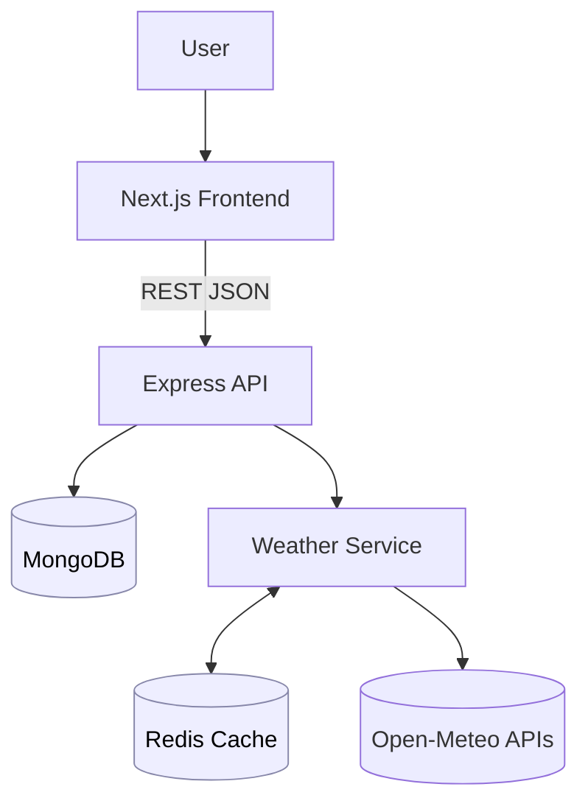

# Weather Widgets

full-stack app to save city “widgets” and show current weather.  
Stack: **Next.js (React)** · **Express/Node** · **MongoDB** · **Redis (cache)** · **Open-Meteo**.

---

## 🚀 Setup Guide

### Prerequisites
- **Node.js v18+**
- **MongoDB** (Atlas or local)
- **Docker** (to run Redis easily)
- **npm**

### 1) Get a MongoDB URI
- **Atlas (recommended)**  
  Create a free cluster → add DB user → whitelist your IP → copy a URI like:
  ```
  mongodb+srv://<user>:<pass>@<cluster>/<db>?retryWrites=true&w=majority
  ```
- **Local Mongo (alternative)**
  ```
  mongodb://127.0.0.1:27017/weather_widgets
  ```

### 2) Start Redis with Docker (one command)
```bash
docker run --name redis -p 6379:6379 -d redis:7-alpine
```
> Stop / start later: `docker stop redis` · `docker start redis`

---

## 🔧 1. Start the Backend

```bash
cd backend
npm install
npm run dev          # or: npm start
```

**Create `backend/.env`:**
```env
MONGODB_URI=mongodb+srv://<user>:<pass>@<cluster>/<db>?retryWrites=true&w=majority
PORT=5000
REDIS_URL=redis://127.0.0.1:6379
```

## 🎯 2. Start the Frontend

```bash
cd frontend
npm install
npm run dev
```

**Create `frontend/.env`:**
```env
NEXT_PUBLIC_BACKEND_URL=http://localhost:5000
```

Open the app: **http://localhost:3000**  
Backend runs at: **http://localhost:5000**

---

## 🧾 API Reference

Base URL: `http://localhost:5000`

| Method | Endpoint         | Body / Query                 | Description |
|------:|-------------------|------------------------------|-------------|
| GET   | `/widgets`        | –                            | List widgets. Stale weather is refreshed best-effort in the background. |
| POST  | `/widgets`        | `{ "location": "Berlin" }`   | Create a widget. Duplicate names are blocked **case-insensitively** (returns 409). |
| DELETE| `/widgets/:id`    | –                            | Delete a widget. |

**Sample — create a widget**
```http
POST /widgets
Content-Type: application/json

{ "location": "Berlin" }
```

**Sample response**
```json
{
  "widget": {
    "_id": "68a5...b17",
    "location": "Berlin",
    "createdAt": "2025-08-20T01:42:57.181Z",
    "__v": 0
  },
  "weather": {
    "temperature": 17,
    "feelsLike": 16,
    "windSpeed": 10.6,
    "summary": "Clear"
  }
}
```

---

## ⚡ Caching 

- Client: **`backend/src/cache/redisClient.js`** (Redis v4)
- Service: **`backend/src/services/weatherService.js`**
- TTL: **`WEATHER_TTL`** (default **600s**)

**How it works**
1. Build a cache key  
   - If coordinates known → `wx:geo:<lat_rounded_3>:<lon_rounded_3>`  
   - Else by normalized name → `wx:name:<lowercased_city>`
2. **GET** the key from Redis  
   - **Hit** → return cached JSON instantly.  
   - **Miss** → call Open-Meteo (geocode if needed), **normalize** to:
     ```json
     { "temperature": <°C>, "feelsLike": <°C>, "windSpeed": <km/h>, "summary": "<text>" }
     ```
     then **SETEX** with TTL and return.
3. If Redis is down/not configured, the service **gracefully falls back** to live API (no crash).
4. Cache entries **expire automatically** via TTL; explicit invalidation isn’t required.

---

## 🏗 Architecture Overview

```txt
.
├── backend/
│   ├── server.js            ← Express entry (imports from ./src)
│   └── src/
│       ├── controllers/
│       ├── models/
│       ├── routes/
│       ├── services/        ← weather service (Open-Meteo) + caching
│       ├── cache/           ← Redis client
│       └── middleware | utils | config (if present)
└── frontend/
    └── src/
        ├── pages/
        ├── components/
        ├── utils/
        └── styles/
```

**Diagram**


---

## ☁️ Weather Data API

- **Open-Meteo Geocoding** — name → coordinates  
  `https://geocoding-api.open-meteo.com/v1/search?name=<city>&count=1`
- **Open-Meteo Forecast (current)** — returns current weather  
  `https://api.open-meteo.com/v1/forecast?latitude=<lat>&longitude=<lon>&current=temperature_2m,apparent_temperature,wind_speed_10m,weather_code`  
  *(Falls back to `current_weather=true`; no API key required.)*

---

## ❗ Troubleshooting

- **CORS** → set `FRONTEND_ORIGIN=http://localhost:3000` and restart backend.  
- **Mongo connect** → check URI & Atlas IP whitelist; or use local Mongo.  
- **Redis** → ensure Docker container is running and `REDIS_URL` is set; hit `/redis-health`.  
- **Env changes** → restart the respective server (Next.js/Node reads env at start).
